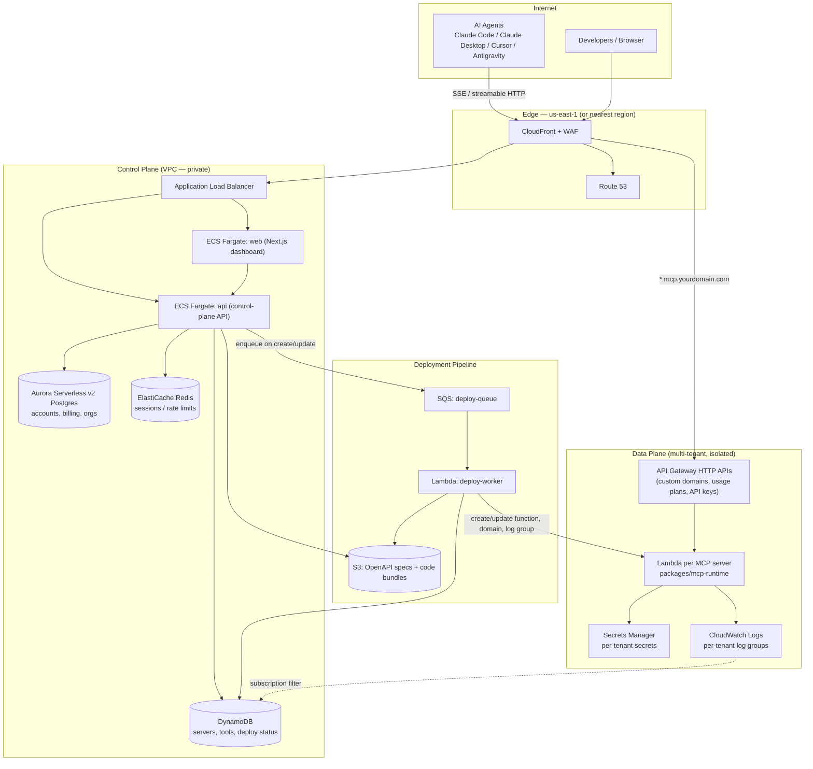
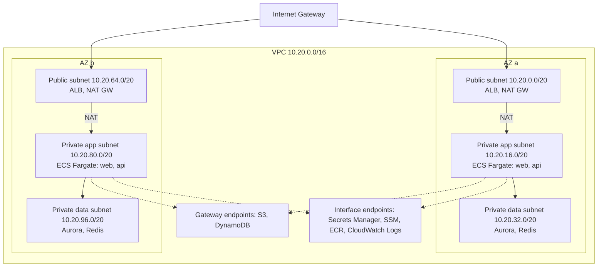
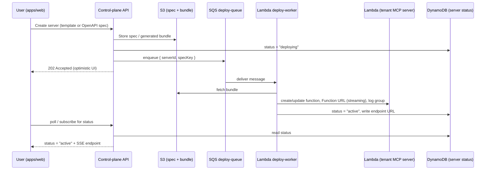

# AWS Architecture — MCP Builder

This document describes the AWS architecture for **MCP Builder**, the open-source PaaS in this
repository. It has two goals at once, on purpose:

1. **Be a real, production-grade design** that this project (or anyone self-hosting it, à la
   Supabase) can deploy on their own AWS account.
2. **Be a deliberate playground to practice core AWS networking** (VPC, subnets, routing,
   endpoints, security groups) instead of hiding it all behind a black-box PaaS.

It should be read together with [`terraform/README.md`](../terraform/README.md) (local iteration
against `floci`, the LocalStack-style AWS emulator already wired into
[`docker-compose.yml`](../docker-compose.yml)), the root [`README.md`](../README.md), and
[`docs/roadmap.md`](./roadmap.md) for the concrete, sequenced build order.

---

> **Update — 2026-09-07: control plane pivots to fully serverless.**
> Sections 3, 4 and 6 below originally put the control plane on ECS Fargate + ALB + Aurora inside
> the VPC. Decision: the control plane moves to **API Gateway (HTTP API) + Lambda + Cognito (JWT
> authorizer) + DynamoDB** instead — no ECS, no ALB, no Aurora, no VPC required for it. Reasons:
> it matches the "serverless end-to-end" goal, `floci` emulates Cognito/API Gateway/Lambda/DynamoDB
> in one lightweight container so the whole backend is testable locally with zero AWS cost, and
> `apps/web` (already built, mocked) can call API Gateway endpoints directly with a Cognito-issued
> JWT — no separate backend session layer needed.
>
> The VPC design in §4 is **not abandoned**, it's **decoupled from the critical path**: it becomes
> its own practice track (e.g. a future "bring your own private DB" feature using Aurora in a real
> VPC, or simply built standalone for the networking practice value). See
> [`docs/roadmap.md`](./roadmap.md) for how the two tracks are sequenced.
>
> Read §3/§4/§6 below as "the fully-managed-network-heavy alternative" for reference and for the
> VPC practice track — the actual build order now follows the roadmap.

## 1. What we're actually hosting

Looking at `apps/web` (the dashboard) and its data model (`apps/web/src/types/mcp.ts`), the product
is a **control plane for MCP servers**:

- A user picks a template or an OpenAPI spec → the platform generates an **MCP server** exposing
  `tools` (HTTP proxy calls or sandboxed code) over an **SSE / streamable-HTTP endpoint**.
- Each server has its own **secrets**, **bearer tokens / API keys**, an optional **custom domain**,
  a **runtime** (Node.js 20 / Python 3.11) with configurable **vCPU/memory**, and per-server
  **logs & metrics** (`LogEntry`, `ServerMetrics`).
- Clients calling the server are agents: Claude Code, Claude Desktop, Cursor, Windsurf, Antigravity,
  custom agents.

That maps cleanly onto **two AWS planes** that must be designed differently:

| Plane | What it is | Traffic shape | Repo mapping |
|---|---|---|---|
| **Control plane** | The dashboard + API that manages accounts, servers, tools, secrets, billing | Steady, low-volume, long-lived | `apps/web`, `apps/api` |
| **Data plane** | The actual per-tenant MCP servers agents talk to | Bursty, multi-tenant, security-sensitive, needs strong isolation | `packages/mcp-runtime`, `packages/openapi-parser`, `apps/infra` |

Conflating the two (e.g. running tenant code inside the same process as the dashboard API) is the
single biggest architectural mistake to avoid — it's a security and noisy-neighbor problem. Every
decision below keeps them separate.

---

## 2. Design principles

- **Self-hostable first.** Anyone forking this repo should be able to `terraform apply` it into
  their own account with a handful of variables (region, domain, account id). No hidden
  proprietary services.
- **Serverless-leaning, VPC where it matters.** Use managed/serverless services (Lambda, Fargate,
  DynamoDB, Aurora Serverless v2) to keep cost near-zero at rest, but still build a *real* VPC —
  because per-tenant network isolation and private data stores are non-negotiable for a PaaS, and
  because that's exactly what you want to practice.
- **Least privilege by default.** No long-lived AWS keys anywhere (not in GitHub Actions, not in
  Lambda env vars) — OIDC federation and scoped IAM roles only.
- **Same Terraform, three targets.** `floci` locally (already in place) → a real `dev` AWS account
  → `staging`/`prod`. Only `provider.tf`/backend config and `.tfvars` change.
- **Tenant blast-radius containment.** One tenant's MCP server (arbitrary tool code, arbitrary
  secrets) must never be able to reach another tenant's data, or the control plane's database.

---

## 3. High-level diagram



---

## 4. Control plane: VPC design (the practice section)

This is the part built specifically so you exercise real VPC concepts, not just click "deploy" on a
managed service. One VPC per environment (`dev`, `staging`, `prod`), 2 Availability Zones minimum
(3 in prod).



**Subnet tiers**

| Tier | Contains | Route to internet | Notes |
|---|---|---|---|
| Public | ALB, NAT Gateways | via Internet Gateway | Only the ALB's SG allows inbound 443 from `0.0.0.0/0` |
| Private (app) | ECS Fargate tasks (`web`, `api`) | via NAT Gateway (outbound only) | No public IPs assigned |
| Private (data) | Aurora, ElastiCache | **no route to NAT** (isolated) | DB subnet group spans both AZs, SG only accepts traffic from the app tier SG |

**Security groups** — always reference other SGs, never wide CIDR ranges:

- `sg-alb`: inbound 443/80 from `0.0.0.0/0`; outbound to `sg-ecs-app` only.
- `sg-ecs-app`: inbound from `sg-alb` on the container port only; outbound to `sg-aurora`,
  `sg-redis`, and 443 (for AWS API calls, ideally routed through interface endpoints instead).
- `sg-aurora` / `sg-redis`: inbound only from `sg-ecs-app`, on 5432 / 6379.
- No security group anywhere allows inbound SSH; operational access is via **SSM Session Manager**,
  not bastion hosts or open port 22.

**VPC endpoints** (this is the detail most tutorials skip, and the one that actually saves money
and improves isolation): put **gateway endpoints** for S3 and DynamoDB (free) and **interface
endpoints** for Secrets Manager, SSM, ECR (`api` + `dkr`), and CloudWatch Logs in the private app
subnets. Once these exist, the app tier's NAT Gateway traffic drops to almost nothing — a good way
to *see* NAT Gateway data-processing charges before and after in Cost Explorer.

**Observability on the network itself**: enable **VPC Flow Logs** to CloudWatch Logs (or S3 for
cheaper long-term storage) from day one, and a **CloudTrail** trail to a dedicated S3 bucket with
object lock for tamper-evidence. Both are cheap and are exactly what you'd be asked to show in a
real infra review.

---

## 5. Deployment pipeline (why servers deploy "4x faster")

The tagline is "create an MCP server 4x faster" — the architecture that actually delivers on that
is an **async, event-driven provisioning pipeline**, not a synchronous `terraform apply` per
tenant:



This is also why `apps/infra` already exists as its own workspace: it's the natural home for the
`deploy-worker` Lambda and the CDK/Terraform-driven per-tenant resource creation, separate from the
dashboard's own build.

---

## 6. Data plane: how one MCP server actually runs

Each row in the `servers` table becomes **one isolated Lambda function** running
`packages/mcp-runtime`, configured from `packages/openapi-parser` output:

- **Compute**: Lambda, sized from the `vCpu`/`memoryMb` fields already in the data model (Lambda
  memory controls proportional CPU). Lambda is the right choice for the data plane because it gives
  per-tenant isolation (separate execution environments), scales to zero (matches the
  `creditsBalance`/`monthlySpend` usage-based billing model), and needs no patching.
- **Ingress / streaming**: MCP's SSE / streamable-HTTP transport needs a long-lived response.
  Use a **Lambda Function URL with `InvokeMode: RESPONSE_STREAM`** for the raw endpoint, and put
  **API Gateway HTTP API** in front of it only where you need **usage plans + API keys** — this is
  what backs the dashboard's `bearerTokens` feature — and **custom domain names** for the
  `customDomain` field (ACM cert + Route 53 record per tenant, or a wildcard `*.mcp.yourdomain.com`
  for the default subdomain).
- **Secrets**: each `SecretItem` is a key in **Secrets Manager**, one secret (or one JSON blob) per
  server, referenced by the function's execution role — never baked into the deployment bundle or
  passed as a plain Lambda environment variable for anything sensitive.
- **Execution role**: one IAM role per server (or per-tenant), scoped by resource ARN/tag condition
  to *only* that server's secret and log group. This is the actual multi-tenant security boundary —
  treat it as seriously as a customer-facing auth check.
- **Code execution mode**: for tools with `executionMode: "code"`, Lambda's own sandboxing
  (Firecracker microVMs) is what makes running arbitrary tenant-supplied code acceptable — don't try
  to build this on long-lived containers/EC2 without an equivalent sandbox.
- **Networking**: keep these Lambdas **outside the VPC** by default (better cold starts, no ENI
  cost). Only attach a function to the VPC (a dedicated, more restricted subnet tier) when a
  specific tool needs to reach a private resource (e.g. the user's own database) — and even then,
  prefer the user configuring their own `DATABASE_URL` against a resource *they* expose, rather than
  peering into their infrastructure.
- **Logs & metrics**: one CloudWatch Log group per server (`/mcp/{serverId}`), which directly backs
  the "Logs & Traces" tab (`LogEntry`). A subscription filter fans out structured log lines into
  DynamoDB or OpenSearch for the `ServerMetrics` rollups (requests/24h, success rate, latency,
  active clients) shown on the server overview.

---

## 7. IAM & CI/CD

- **No static AWS credentials, anywhere.** Configure a GitHub Actions **OIDC identity provider** in
  IAM (you already have `iam-oidc-providers.json` in your local `floci` data — this is that same
  resource, for real) trusting `token.actions.githubusercontent.com`, scoped to this repo, assuming
  a `gha-deploy` role.
- **Split deploy roles by blast radius**: `gha-deploy-infra` (can touch VPC/ECS/RDS/Terraform state)
  vs. the `deploy-worker` runtime role (can only create/update Lambda functions, API Gateway
  mappings, Route 53 records, and Secrets Manager entries that match a `Project=mcp-builder`
  tag/naming convention) — the worker should never be able to touch the control plane's own
  database or the Terraform state bucket.
- **Terraform remote state**: an S3 bucket (versioned, encrypted) + DynamoDB lock table, one per
  environment — a good use of the exact `aws_s3_bucket`/`aws_dynamodb_table` resources already in
  `terraform/main.tf` once you point them at real AWS.
- **Pipeline**: PR → `terraform plan` (can run against `floci` locally, or against real AWS
  read-only credentials in CI) → merge to `main` → OIDC-assumed role → `terraform apply` to `dev` →
  manual approval gate → `staging` → manual approval gate → `prod`. Container images for `web` and
  `api` build to **ECR** with image scanning on push.

---

## 8. Terraform layout

The repo already has the right skeleton (`terraform/modules/vpc`, `terraform/modules/mcp_instance`)
— they're currently empty placeholders. Suggested module boundaries:

```
terraform/
  provider.tf          # backend + provider, swapped per environment
  main.tf              # today: S3/SQS/DynamoDB/SSM smoke-test resources against floci
  environments/
    dev.tfvars
    staging.tfvars
    prod.tfvars
  modules/
    vpc/                # VPC, subnets (3 tiers x N AZs), IGW, NAT, route tables,
                         # gateway + interface endpoints, flow logs, SGs
    control-plane/       # ALB, ECS cluster/services/task defs, Aurora, ElastiCache
    deploy-pipeline/     # SQS queue, deploy-worker Lambda, S3 bundle bucket
    mcp_instance/        # per-tenant: Lambda function, Function URL, API Gateway
                         # mapping, Route53 record, Secrets Manager secret, log group
    ci/                  # GitHub OIDC provider + deploy roles
```

`mcp_instance` is deliberately a reusable module invoked once per server (either by Terraform Cloud
runs triggered from the deploy-worker, or — more realistically at PaaS scale — by the deploy-worker
calling the AWS SDK directly using the same resource shapes this module documents, so per-tenant
deploys don't pay Terraform's plan/apply latency). Keep the module as the source of truth for what
"one MCP server" looks like on AWS even if the runtime path calls the SDK directly.

---

## 9. Environments & promotion path

| Stage | Where | Purpose |
|---|---|---|
| **Local** | `docker-compose.yml` → `floci` + `floci-ui` | Fast iteration, zero AWS cost, safe place to practice destructive Terraform changes (already set up) |
| **dev** | Real AWS, single NAT, `db.serverless` min ACU, no custom domains | Personal AWS-account practice environment for VPC/IAM/ECS |
| **staging** | Real AWS, mirrors prod topology at smaller scale | Pre-prod validation, what CI promotes to automatically |
| **prod** | Real AWS, NAT per AZ, Aurora Multi-AZ, WAF, alarms → on-call | Public-facing |

Only `provider.tf` (backend key, account/region) and the `.tfvars` file change between stages — the
module code stays identical, which is the whole point of testing against `floci` first.

---

## 10. Observability & alarming

- **CloudWatch Alarms** on: ALB `5xx` rate, ALB target unhealthy host count, ECS service CPU/memory,
  Lambda error rate + throttles (both control-plane and per-tenant aggregate), Aurora CPU/storage,
  SQS `deploy-queue` age-of-oldest-message (a growing number means the deploy pipeline is falling
  behind — directly threatens the "4x faster" promise).
- **SNS topic** → email/Slack/PagerDuty for the above.
- **CloudTrail** organization/account trail → S3, for audit of who changed what.
- **Dashboards**: one CloudWatch dashboard for the control plane, one templated view per tenant
  server (feeds the in-app "Overview" metrics).

---

## 11. Cost shape (rough, us-east-1, `dev`-sized)

| Component | Approx. monthly (dev-sized) |
|---|---|
| NAT Gateway (1x) | ~$33 + data processing |
| ALB | ~$16 + LCU |
| ECS Fargate (2 tasks x 0.25 vCPU/0.5GB, always-on) | ~$15 |
| Aurora Serverless v2 (min 0.5 ACU) | ~$45 (or swap for DynamoDB-only in dev to go near-$0) |
| Lambda (data plane) | pay-per-invoke, effectively $0 at dev traffic |
| DynamoDB (PAY_PER_REQUEST) | pay-per-request, effectively $0 at dev traffic |
| CloudWatch Logs/Alarms, S3, Secrets Manager | a few dollars |

Two cheap early exercises that map directly to money you can watch move in Cost Explorer: turning
on VPC interface endpoints (NAT data-processing charges drop) and switching Aurora to
Serverless v2 scale-to-near-zero for `dev`.

---

## 12. Suggested build order (a learning path, not just a spec)

1. **VPC module only.** Stand up the VPC, subnets, IGW, NAT, route tables, SGs, and endpoints from
   §4 in a throwaway `dev` account. Verify with `aws ec2 describe-*` and VPC Reachability Analyzer
   that a task in the private app subnet can reach the internet via NAT but isn't reachable from it,
   and that it *can* reach Secrets Manager via the interface endpoint even if you delete the NAT.
2. **Control plane compute.** ALB + ECS Fargate running the existing `apps/web` Docker image (it
   already has a working `Dockerfile`), talking to a DynamoDB table (reuse the pattern in
   `terraform/main.tf`).
3. **One real tenant Lambda by hand** (`terraform/modules/mcp_instance`): a single Lambda running
   `packages/mcp-runtime` with a Function URL and a Secrets Manager secret, wired to a real custom
   domain in Route 53 — prove the data-plane shape end-to-end before automating it.
4. **Deployment pipeline.** SQS + `deploy-worker` Lambda that turns an API call into step 3,
   automatically. This is what turns the manual proof into the actual product feature.
5. **CI/CD + OIDC.** GitHub Actions assuming a role via OIDC, `terraform plan` on PRs, gated
   `apply` on merge.
6. **Harden for prod.** Multi-AZ NAT, WAF on CloudFront/ALB, Aurora Multi-AZ + automated backups,
   alarms + SNS, CloudTrail + Flow Logs retention policy, and (optional, for real multi-tenant scale)
   splitting tenant workloads into a **separate AWS account** from the control plane via AWS
   Organizations, so a compromised tenant Lambda role can never reach the control plane's account at
   all — the strongest version of the isolation goal in §1.

---

## 13. Self-hosting (open-source angle)

Because this project is meant to be forkable and self-hostable like Supabase, the Terraform in
`terraform/` should stay the single source of truth for "how do I run this on my own AWS account,"
with:

- A documented minimal variable set (`domain_name`, `aws_region`, `environment`) to get `dev`
  running.
- No assumption of a specific AWS Organization structure for the minimal path — the multi-account
  split in §12 step 6 is an optional hardening step, not a requirement to get started.
- The `floci`-backed `docker-compose.yml` workflow kept as the documented "try it with zero AWS
  account" on-ramp for contributors, exactly as it is today.
